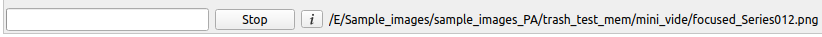

[//]: # (# pyTA)

 <h1>pyTA</h1> 

 

**pyTA** is the **python version of** the **Tissue Analyzer** software. pyTA is an open source tool to segment and analyze epithelial tissues and their dynamic. 

## Install/Run pyTA

1. **Software installation**
    - pyTA can be installed on any recent computer capable of running Conda and Python 3.7 (or >)
    - Open the system command line (see Tips)
    - Type 'conda create -n TA python=3.7', without the quotes, to create and activate a Conda environment for pyTA
    - Type 'conda deactivate' to leave the current Conda environment
    - Enter the pyTA environment by typing 'conda activate TA'
    - Install pyTA by running the following command 'pip install --user --upgrade epyseg'.

 
   
2. **Run pyTA**
    - Open a terminal (see Tips)
    - Type 'conda activate TA' in the terminal to activate the environment
    - Type 'epyseg.ta' to open the TA graphical user interface

**Tips**:
- Open a terminal on:
  - Windows: press 'Windows+R', then type 'cmd' without quotes
  - Mac OS:  press 'Command+Space', then type 'terminal' without quotes
  - Linux:   press 'Ctrl+Alt+T'

## Getting started

Below is the pyTA graphical user inteface (GUI)

**Tips**:
- Dropping files on the user interface loads them in the List located on the right of the GUI
- Clicking on an image in the List loads it
- Double-clicking on an image in the List opens its associated folder (if it exists)
- Tabs are ordered (i.e. some buttons can/will return errors if actions from the previous tab have not been executed). NB: some tabs are optional (e.g. Pre-process)
- Images can only be edited in the 'Segmentation' tab
- pyTA supports (tiff, bmp, png, jpg, lif, czi and lsm files)
- pyTA supports up to 32 bits per channel (TA used to support up to 16 bits per channel)
- pyTA supports an almost infinite number of channels (TA used to support at most 3 channels)

## Icons

#### Drawing panel

From left to right: 
- Pen size (for drawing and erasing)
- Save button (same as 'Ctrl+S')
- Show/Hide mask (same as 'M')
- Apply button (same as 'Enter')
- Remove small cells and apply (Same as 'Shift+Enter') (the spinner can be used to specify minimum cell size allowed, it is set to 10 on this image)
- Channel selection combo (by default merge is selected, some functions are channel sensitive in pyTA so select the epithelial cell label here)
- Zoom+
- Zoom-
- Reset Zoom
- Full Screen
 
#### List

From left to right: 

- Save as list (by default the list of opened images is saved in the same folder as the first image in the list). If a list already exists in this folder, the user is prompted for a new name/location
- Removes selected image(s) from the list
- Copies selected images in the list to the system clipboard
- Pastes the content of the system clipboard to the list (if valid images are pasted they will be added to the list)
- Sort list (as humans would do/natsort)

#### Status bar

 

From left to right: 
- Progress bar
- Stop button (Attempts to stop the current running thread). NB: stopping deep learning or other processes may take time, please be patient ;-)
- About (i)
- Current selection path

## Shortcuts

| Shortcuts        | Action                                                                                                          |
|------------------|-----------------------------------------------------------------------------------------------------------------|
| M                | Show/Hide mask                                                                                                  |
| F12 or F         | Set drawing pane full screen/return to window mode                                                              |
| Enter            | Apply maks edits (drawing/removing bonds)                                                                       |
| Shift & Enter    | Apply maks edits (drawing/removing bonds) and removes small cells (i.e. cells below the specified cut-off area) |
| Ctrl/Command & M | Rerun the watersehd locally (requires at least two drawn seeds)                                                 |
| Ctrl & S         | Save mask edits (in 'Segmentation' tab)                                                                         |
| Ctrl & +         | Zoom+                                                                                                           |
| Ctrl & -         | Zoom-                                                                                                           |
| Ctrl & 0         | Reset zoom                                                                                                      |

## Pre-processing (Optional)

1. Select the 'Pre-processing' tab
2. Drag and Drop Z stacks (XYZ image) on the user interface
3. Press 'Surface projection' if you don't want the image to be denoised
  > **or**  
4. Press 'Denoising surface projection' if you don't want the image to be denoised

**Tips**:
- XYZT images are not supported for surface projection, please split them into series XYZ images using FIJI/ImageJ
- pyTA uses a derivative of the [CARE](https://www.nature.com/articles/s41592-018-0216-7) model, custom trained, to generate (denoised) surface projections from 3D epithelial stacks
- pyTA generates a **height map** used for surface extraction, this height is **mandatory to obtain 3D measurements** for cells
- The surface projection aims at extracting the cortex of epithelial cells
- The denoising algorithm tends to remove noise from the surface projection image, but it may also generate extra/artificial boundaries
- We highly recommend not to use (denoised) surface projections for fluorescence intensity quantification, ideally they should be used only for segmentation
- Surface projections (denoised or not) are saved in a folder named 'surface_projection' 
- Surface extraction and denoising can be slow without an appropriate GPU ($$$$$TODO offer online training --> not very HARD$$$$$$)
- If you plan to use 3D measurements, please check the file named 'height_map_quality_test.tif' generated, if it contains errors (holes, missing cell signal or shows block artifacts, ...) then the corresponding 3D measurements will be erroneous and should not be used. Correcting the height map can solve the problem, pyTA contains no tools to correct height maps.

## Segmentation

1. Select the 'Segmentation' tab
2. Drag and drop XY images (surface projection, maximum projection, ...) on the user interface
3. Press 'Deep learning/EPySeg segmentation'

**Tips**:
- Segmentation using deep learning can be slow without an appropriate GPU, please be patient ($$$$$TODO offer online training --> not very HARD$$$$$$)
- If the resulting deep learning segmentation is of low quality (i.e. over and/or under segmentation); it is likely that your images significantly differ from the ones used to train the deep learning model and that retraining the model on your samples could help
- Segmentation can be achieved without deep learning, i.e. using the Watershed algorithm. However, we recommend using the watershed segmentation only when deep learning segmentation fails, because the watershed masks always contain a significant number of errors (under and over segmentation) 

## Editing segmentation

Segmented cells may contain segmentation errors (usually there very few when using deep learning segmentation, but significantly more using the Watershed algorithm) 

#### Adding bonds manually

1. Select the 'Segmentation' tab
2. Select the image to correct in the List
3. Draw over missing bonds (left click) and pay attention to intersect two other existing bonds (see below)

4. Press 'Enter' or 'Shift+Enter' to apply the edit
5. Press the 'Save' icon below the drawing panel to apply/store the edit 

**Tips**:
- Several missing bonds can be drawn before pressing 'Ctrl+M'

#### Adding bonds semi-automatically

1. Select the 'Segmentation' tab
2. Select the image to correct in the List
3. Draw dots (left click) in the cells (ideally close to the cell centroid) surrounding the missing bond (see below)

4. Press 'Ctrl+M' to run the watershed algorithm locally and restore the missing bond
5. Press the 'Save' icon below the drawing panel to apply/store the edit

**Tips**:
- Several missing bonds can be restored at the same time just draw dots around every missing bond before pressing 'Ctrl+M'
- The manual bond drawing and the semi-automated bond addition are incompatible with one another, please make sure not to use both at the same time before applying the correction (i.e. pressing 'Enter', 'Shift+Enter' or 'Ctrl+M') 

#### Removing bonds

1. Select the 'Segmentation' tab
2. Select the image to correct in the List
3. Draw over erroneous bond (Right click) to remove a few red pixels around the center of the bond (see below) and please pay attention not to intersect any adjacent junction

6. Press 'Enter' or 'Shift+Enter' to apply the edit
7. Press the 'Save' icon below the drawing panel to apply/store the edit 

**Tips**:
- Several missing bonds can be removed before pressing 'Enter' or 'Shift+Enter'

## Properties (Optional)

Just say what this stuff can be used for...

## Analysis

NB: This step should be done only after images have been segmented and the segmentation errors have been removed

1. Press 'Measure cell properties'
   - Select a cut-off (typically some percentage of the average bond length) (the cut-off is only used for the polygonal approximation of the cells)
   - Select a cell cut-off area (i.e. a minimal area in pixels for a cell to be considered as a cell). Any cell smaller than that will be erased automatically (similar to pressing 'Shift+Enter') from the mask and be ignored in the quantification.
   - Tick 'Measure polarity' if you are interested in nematic/axial polarity measurements
   - Tick '3D measurements' if you are interested in 3D measurements (A height map file, generated in the Pre-processing step, see above, is mandatory for 3D measurements). Please check the 'height_map_quality_test.tif' file for errors, any error in this file corresponds to an error in the 'height_map.tif' file and will result in erroneous 3D measurements.
   - Tick 'Multi Threading' to speed up the analysis (Experimental, if errors occur or the software stays stuck, untick this) 

## Tracking

1. Select the 'Tracking' tab
2. Press 'Track cells'
  > **or**  
3. Press 'Track cells (static tissue)'

NB track cells static tissue seems to work much better --> is that true --> check

**Tips**:
- Better tracking can be achieved using [Mermaid](https://github.com/uncbiag/mermaid) (Tuto coming soon)

## Advanced segmentation and tracking correction

1. Select the 'Advanced segmentation and tracking correction' tab
2. Press 'Fix mask and tracks dynamically'
3. A new window appears (see below), showing the current frame (middle images) along with the previous (left images) and next frame (right images)

3. The last row shows the score obtained by the current image compared to its previous and next frame, low scores (i.e. dark intensities) often indicates segmentation and/or tracking errors.
   - First fix all the segmentation errors (because these errors will inevitably lead to tracking errors)
   - Fix tracking errors (only if/when all segmentation errors have been fixed for all images, see first tip below)
   - If segmentation and tracks are ok for the 3 frames then press 'Next' to move to the next frame
4. Once done with the 3 image press 'Next'
5. Repeat the above steps until all images are correct

**Tips**:
- **NEVER ATTEMPT TO FIX A TRACK ERROR BEFORE ALL THE SEGMENTATION ERRORS, FOR ALL THE IMAGES OF THE TIME-LAPSE, HAVE BEEN FIXED AND THE TRACKING HAS BEEN RERUN** 
- To fix a segmentation error you can draw/delete bonds on any of the images in the first row. Once the edit is done for one image, press 'Enter' or 'Shift+Enter' while the mouse is still on this image to apply the changes
- To fix cell swapping in the tracks draw (left click) over the two swapped cells (on a single image), then press 'Enter', the swapping should be fixed on the drawn image and all the following ones
- To fix lost cell (connect two cell ids/recolor a cell with wrong id), draw over a single cell in one frame and draw over the same cell in the frame where the color has changed, then press 'Enter', the tracks should be connected

## Export (CSV)

Data contained in the SQL libraries generated by pyTA can be exported as CSV for analysis using MS Excel or alike

- Press 'Export cell data' to recover 2D/3D cell database entries
- Press 'Export bond data' to recover bond database entries

## Preview

In the 'Preview' tab, you can preview images or database entries as images (e.g. display color coded area over the original image)

- Select an image or a database entry (the latter starts with a '#') in the Image/Data combo
- Tick 'Color coding' if a LUT should be applied to the displayed image 
  - Lut can be changed if needed
  - Local (color code is computed only for the displayed image) or global (color code is having the same max and min values for all the images contained in the list) color coding can be applied
  - A percentage of outliers can be set to exclude erroneous data (erroneous values often stretch the color coding too much, making normal cells hard to see)
- Tick 'Overlay/Blend' if the color coded or displayed image must be overlaid on the original image
  - If the image has several channels, select the channel of interest or the merge using the 'Background image channel' combo
  - Change opacity if overlay colors are not showing properly
- Displayed image or stack can be exported by oressing 'Single image' or 'Stack' respectively

## pyTA settings

**Work in progress**

pyTA default settings can be changed here

-Tick 'Use CPU' to force deep learning prediction to use CPU even when a graphic card is available on the system (useful if you get memory errors or if another application is using your graphic card). NB: Ticking this must be done immediately after starting pyTA. If you have already run any deep learning function before ticking this, pyTA will ignore the command and continue using the GPU  

## Log

The log window shows errors in red and pyTA provided information in black. Please report bugs (i.e. copy (red) log content) to [baigouy@gmail.com](baigouy@gmail.com)

## Units

TA gives measurements in pixels (perimeter, area, ...). The user must apply a scaling factor to values in pixels to be biologically significant (e.g. multiply perimeter by pixel size or multiply area by the square of pixel size).

## Divisions/...

## Plots...

## SQL ???

## What else ???

